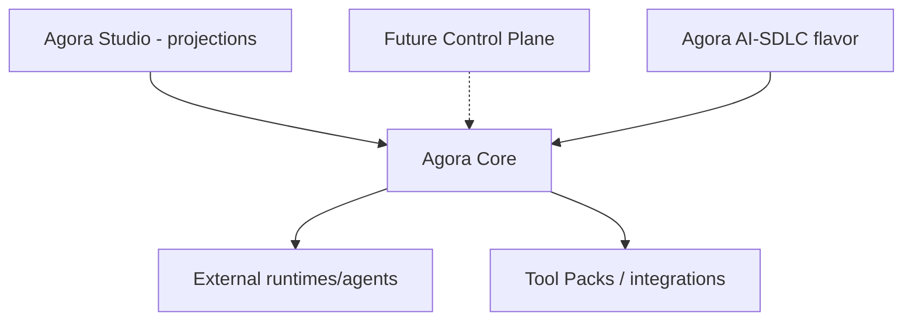

# Architecture

Conceptual architecture of the Agora AI-SDLC flavor. Nothing here is implemented yet unless stated; see [product-scope.md](product-scope.md). Boundaries: [repository-boundaries.md](repository-boundaries.md). Terms: [terminology.md](terminology.md).

## Layers

- **Core** owns the lifecycle engine, gate enforcement, durable state and Tool Pack operations.
- **Flavor** (this repo) composes Core capabilities into AI-SDLC: manifest, Method Pack, policies, profiles, templates, samples. It never duplicates lifecycle logic.
- **Studio** renders Core projections; it holds no lifecycle policy.
- **Runtimes** (Codex, Claude Code, OpenCode, Ollama, ...) are replaceable actors; no runtime is required.
- Markdown and Git remain the project source of truth.

## Concepts

- **Flavor manifest** (`agora/flavor/v1`, issue #11): id, version, supported Core range, included packs, profiles, policies, required capabilities.
- **Method Pack**: declares lifecycle `readiness -> intent -> inception -> construction -> operations -> completed`, rework edges (`inception -> intent`, `construction -> inception`, `operations -> construction`), protocol and provider-neutral tools.
- **Roles**: authority and capability matrix; the accountable role holder is preserved when execution is delegated to AI.
- **Gates and evidence**: no transition without required evidence; missing evidence, unresolved clarification or missing approval fail closed.
- **Policies**: producer/reviewer separation, data classification and runtime eligibility, budgets and fallback, provenance.
- **Profiles**: Starter, Enterprise, Modernization, Regulated depth/adoption profiles composed from shared assets.
- **Integrations**: the implemented GitHub and GitLab delivery, Jira work-management, generic CI/CD evidence, and security-finding profiles compose Core's provider-neutral Tool Pack, evidence, and structured-finding operations; observability remains planned. External systems remain operational sources, while Core remains lifecycle authority.

## Allowed dependencies

Agora Core (`agora-framework`, compatible range) and development-only test/lint tooling. No LLM SDK, cloud SDK or provider runtime dependency.

## Pending decisions

- Final compatible Agora Core range (depends on a released Core boundary).
- Manifest field normative/presentation split (#11).
- Depth-profile defaults (#20).
- Registry signing approach for Enterprise (#33).
- ADRs for separate flavor repo, no embedded LLM SDK and provider-neutral naming (#12).
