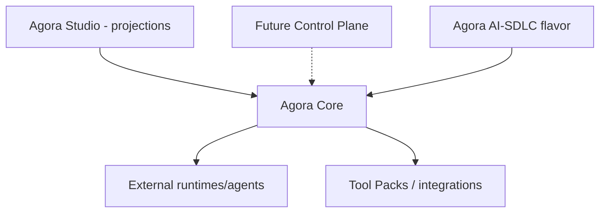

# Architecture

Decisions: [ADR-0001](decisions/ADR-0001-separate-flavor-repository.md), [ADR-0002](decisions/ADR-0002-no-embedded-llm-sdk.md), [ADR-0003](decisions/ADR-0003-provider-neutral-naming.md). Product: [vision](product/vision.md), [positioning](product/positioning.md).

Conceptual architecture of the Agora AI-SDLC flavor. Nothing here is implemented yet unless stated; see [product-scope.md](product-scope.md). Boundaries: [repository-boundaries.md](repository-boundaries.md). Terms: [terminology.md](terminology.md).

## Layers

```mermaid
flowchart TB
  Studio[Agora Studio - projections] --> Core
  CP[Future Control Plane] -.-> Core
  Flavor[Agora AI-SDLC flavor] --> Core[Agora Core]
  Core --> Runtimes[External runtimes/agents]
  Core --> Tools[Tool Packs / integrations]
```

- **Core** owns the lifecycle engine, gate enforcement, durable state and Tool Pack operations.
- **Flavor** (this repo) composes Core capabilities into AI-SDLC: manifest, Method Pack, policies, profiles, templates, samples. It never duplicates lifecycle logic.
- **Studio** renders Core projections; it holds no lifecycle policy.
- **Runtimes** (Codex, Claude Code, OpenCode, Ollama, ...) are replaceable actors; no runtime is required. They split into *agent runtimes* (repository-aware hosts: Claude Code, Codex, OpenCode) and *model runtimes* (Ollama), combined by `agora-ai-sdlc/runtime-binding/v2`; a model runtime alone never satisfies an agent-execution requirement. Legacy flat entries normalize deterministically; ambiguous ones fail with a typed diagnostic.
- Markdown and Git remain the project source of truth.

## Concepts

- **Flavor manifest** (`agora/flavor/v1`, issue #11): id, version, supported Core range, included packs, profiles, policies, required capabilities.
- **Method Pack**: declares lifecycle `readiness -> intent -> inception -> construction -> operations -> completed`, rework edges (`inception -> intent`, `construction -> inception`, `operations -> construction`), protocol and provider-neutral tools.
- **Roles**: authority and capability matrix; the accountable role holder is preserved when execution is delegated to AI.
- **Gates and evidence**: no transition without required evidence; missing evidence, unresolved clarification or missing approval fail closed.
- **Policies**: producer/reviewer separation, data classification and runtime eligibility, budgets and fallback, provenance.
- **Profiles**: the implemented Starter, Enterprise, Modernization and Regulated adoption profiles compose shared assets without forking Core. Enterprise delegates registry trust and transactions to Core; Modernization evaluates additional artifact/evidence obligations before delegating transitions; Regulated delegates actor identity, signatures, stale preconditions and lifecycle mutation to Core while the flavor owns segregation, provenance completeness and exception/retention metadata.
- **Integrations**: the implemented GitHub and GitLab delivery, Jira work-management, generic CI/CD, security-finding, and operational-evidence profiles compose Core's provider-neutral Tool Pack, evidence, control-band, and structured-finding operations. External systems remain operational sources, while Core remains lifecycle authority.
- **Studio projection**: the [AI-SDLC projection v1](integrations/studio-projection.md) composes versioned Core read DTOs with flavor-owned policy projections behind a Core application-service boundary. Browser requests use server-issued selection ids, never filesystem paths; presentation hints are explicitly non-authoritative.

## Allowed dependencies

Agora Core (`agora-framework`, compatible range) and development-only test/lint tooling. No LLM SDK, cloud SDK or provider runtime dependency.

## Pending decisions

- Final compatible Agora Core range (depends on a released Core boundary).

## Agent capability manifests

`agora-ai-sdlc/agent-capability-manifest/v1` declares, per agent runtime, which integration mechanisms it supports (`aisdlc runtimes --capabilities`). It is static: no lifecycle state, Laya decisions, approvals, availability or observations. Discovery observes installation, policy decides use, Laya advises, Core is authority. Every capability id is explicit; unknown agents or ids fail closed.

Adding an adapter: register a manifest in `agent_capabilities.py` via `build_manifest` with every id claimed explicitly (claim only what the adapter implements), then add it to the parity test.

## Execution requirements

`agora-ai-sdlc/execution-requirements/v1` (`execution_requirements.py`) turns a deterministic execution bundle plus *accepted* advisory (Laya) answers into provider-neutral requirements: activity class, reasoning tier (`local|standard|frontier|human`), risk, security review, validation focus and required capability ids. The action-to-capability mapping is owned by AI-SDLC. Advisory answers can only raise tier, risk or security focus; low-confidence, invalid or failed answers are kept as escalations and never remove a deterministic requirement. `human` yields a non-executable human-authority requirement. Advisory model/checkpoint is provenance only; no runtime or provider is named.

## Capability admission

`select_runtime(..., requirements=, availability=)` evaluates each candidate in configured order: policy, budget, availability, agent capabilities, model binding; the first admissible candidate wins, with no scoring or LLM call. Blocker codes: `runtime.agent_required` (model runtime alone, e.g. Ollama), `runtime.agent_unknown`, `runtime.capability_missing` (with `missing_capabilities` per considered candidate), `runtime.model_binding_missing` (local tier without a model binding), `runtime.integration_unavailable`, `runtime.model_unavailable`, `runtime.human_authority_required` (terminal). Static manifests are never mixed with discovery observations. Fallback after an admission failure needs the explicit signals `runtime-unavailable` or the opt-in `capability-mismatch`; ordinary task failure still cannot change runtime.

## Execution envelope

`agora-ai-sdlc/execution-envelope/v1` (`execution_envelope.py`) carries the exact next authorized operation: work identity and Core state revision, responsible actor and role, `ExecutionRequirements`, the runtime binding (agent + model) and a structured `next_transition` (stable operation id plus ordered typed arguments; the `display` string is derived). Actor, role, agent and model are separate fields; the actor is always explicit and validated against Core, so a runtime name (`claude`) never resolves to an actor (`ai-claude`). A human boundary yields a non-executable `stop.human_authority` envelope. Adapters call `verify_integrity` (digest check rejects any altered operation or argument) and `validate_current` before mutation; stale revision, a new human boundary, revoked authority or an inadmissible binding return typed reasons and require recalculation.
