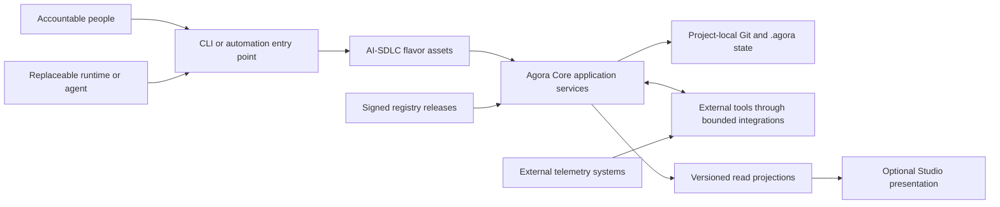

# Vendor-neutral reference architecture

This reference architecture describes the shipped, self-managed Agora AI-SDLC distribution. It is a logical model, not a cloud landing zone, hosted service, or production guarantee. Git and Markdown remain the project source of truth; external systems remain authoritative for the facts they produce.

## Primary technology-neutral architecture

The arrows describe logical exchanges, not network placement. A deployment may run every executable component on one workstation or distribute automation across customer-controlled runners. There is no required cloud, model provider, runtime, Studio instance, or hosted Agora service.

## Ownership and trust boundaries

| Boundary | Authority and behavior |
| --- | --- |
| **Agora Core** | Owns lifecycle state, transitions, gates, approvals, durable records, signed registry verification, and generic Tool Pack operations. Required evidence or approval that is missing fails closed. |
| **Agora AI-SDLC flavor** | Supplies the Method Pack, profiles, policies, templates, samples, and deterministic validation that specialize Core for AI-SDLC. It does not duplicate Core lifecycle mutation or host a provider runtime. |
| **Agora Studio** | Is an optional presentation consumer of versioned Core application projections. It does not parse Method Packs, read or write `.agora/`, calculate authoritative policy decisions, or mutate lifecycle state directly. The aggregate AI-SDLC projection is a documented future compatibility boundary, not a currently complete integration. |
| **External runtimes and agents** | Execute delegated work through customer-selected processes. They are replaceable and have no inherent authority from their model name. Accountable people and configured Core roles retain approval and decision authority. |
| **External tools** | Source delivery, work-management, scanner, CI, deployment, and telemetry facts. Integrations normalize bounded metadata and references; they do not make Agora authoritative for the external system. |
| **Project repository** | Holds reviewed source, Markdown artifacts, configuration, and project-local `.agora` state under the customer's repository controls. |
| **Future Control Plane** | Is outside the current product. There is no current tenancy, hosted registry, fleet transaction, or multi-user identity service to place in a deployment. |

The browser-facing Studio boundary uses an opaque server-issued project selection, not a filesystem path. Core application services produce durable read DTOs and remain between Studio and project state. See the [Studio projection contract](../integrations/studio-projection.md) for implemented sources and current gaps.

## Deployment patterns

### Developer workstation and local execution

A person invokes the CLI and a selected runtime from a controlled workstation against a local Git checkout. Core records lifecycle state and evidence in the project; the flavor supplies policy and method configuration. External calls, including model calls, occur only through the separately configured runtime or tool wrapper. Studio is optional and, when used, consumes a trusted loopback host's Core projections.

Use this pattern for evaluation, authoring, review, and the credential-free samples. Local placement is not proof of isolation: the customer still controls operating-system access, process boundaries, network egress, credentials, backups, and classification of inputs.

### CI automation

Customer-operated CI checks out a pinned revision, installs compatible Core and flavor packages, and runs explicit CLI or application-service operations. Short-lived runners should obtain credentials from the CI secret facility and pass only bounded, redacted observations to integrations. Generated evidence is committed or otherwise preserved under the repository's approval and branch-protection process.

Parallel jobs must not be treated as a cross-repository transaction. A job should report its project result, preserve diagnostic evidence without secrets, and fail the protected workflow when required validation or evidence is unavailable. The [CI evidence profile](../integrations/ci.md) describes normalization; it does not operate the customer's CI system.

### Self-managed enterprise

An organization publishes immutable, signed flavor-registry releases and distributes reviewed public trust roots and Enterprise configuration through its own controls. Each project previews and applies a signed snapshot independently. Core verifies signatures, checksums, extraction, and transactional project placement; the customer operates publishing, private-key custody, artifact transport, rollout waves, inventory, and fleet reporting.

There is no Control Plane transaction across repositories. Mixed versions can exist during rollout, so automation must expose per-project success, failure, and installed checksum. Recovery uses a reviewed, higher-version signed forward release rather than editing generated records or forcing a downgrade. See the [Enterprise profile](../profiles/enterprise.md) and its [offline sample](../../samples/enterprise/README.md).

## Replaceable components

| Replacement point | Stable boundary | Deployment choice |
| --- | --- | --- |
| Runtime, agent, provider, and model | Core actor/session facts plus flavor provenance, data-handling, review, budget, and runtime-selection policies | Any compatible local, customer-controlled, or external runtime; eligibility depends on policy and observed facts, not brand |
| Delivery and work-management system | Provider-neutral Tool Pack operations and normalized work/delivery records | Supported profiles or a separately reviewed wrapper that preserves the neutral contract |
| CI and security scanner | Bounded evidence and finding contracts | Customer-selected CI/scanner; raw reports and secrets remain outside flavor state |
| Monitoring backend | Neutral metric, deployment, and smoke observations | Customer-selected collector translating fresh observations; Agora does not collect telemetry itself |
| Registry transport | Core registry index, signature, checksum, and safe extraction contract | Credential-free HTTPS or reviewed local source; trust keys and publishing remain customer-controlled |
| Presentation | Versioned Core read DTOs and flavor projections | CLI is sufficient; Studio is optional and cannot become lifecycle authority |

Replacing a component does not make its facts trustworthy automatically. The deployment must preserve identity, freshness, revision, environment, provenance, and redaction requirements defined by the relevant contract.

## Data and control flow

1. A human or automation selects a project, accountable actor, work item, and allowed runtime.
2. Flavor checks that precede execution evaluate declared inputs, runtime eligibility, provenance, segregation, and profile requirements as applicable.
3. The external runtime performs work within deployment controls and returns artifacts or bounded facts. Credentials and raw sensitive payloads do not become Agora evidence metadata.
4. Integrations normalize external facts and Core records artifacts, evidence, reviews, approvals, and lifecycle actions.
5. Core alone decides whether its lifecycle transition contract is satisfied. Passing a flavor validation does not prove that infrastructure controls operated correctly.
6. Optional Studio views consume projections; external monitoring and fleet automation consume exported facts under customer control.

## Failure and recovery paths

| Failure | Expected behavior | Recovery owner and path |
| --- | --- | --- |
| Runtime unavailable, denied, over budget, or missing trustworthy provenance | Do not launch or record false success; keep the work blocked and retain a secret-safe reason | Customer selects an eligible runtime or approved fallback and repeats the governed action |
| External CI, scanner, work system, or telemetry unavailable | Required observations remain unavailable or stale and dependent gates fail closed | Customer restores the source system or submits new fresh evidence; Agora does not invent or cache success |
| Malformed, mismatched, stale, or credential-bearing evidence | Normalization rejects it before authoritative lifecycle use | Source owner corrects/redacts and resubmits against the expected revision, environment, and schema |
| Registry signature, checksum, archive, or apply failure | Core rejects the release and preserves or restores the prior project snapshot | Registry operator fixes publishing and issues an immutable signed release; use a signed forward release for content recovery |
| Partial enterprise rollout | Successful projects keep their verified version; failed projects remain independently visible | Customer fleet automation reports every result, pauses the wave when policy requires, and retries per project after remediation |
| Studio unavailable or projection section unavailable | Lifecycle state remains intact and CLI/Core operations continue; Studio shows explicit unavailability when it can render the envelope | Customer restores the optional presentation path; never bypass Core by editing `.agora` |
| Project repository or state loss | Agora provides no hosted backup or cross-project recovery service | Customer restores a tested repository backup, validates it, and reconciles external facts under its recovery procedure |
| Suspected credential, key, runtime, or evidence compromise | Stop affected automation and do not rely on unverified records or signers | Customer incident owner contains access, rotates/revokes credentials or keys, preserves evidence, assesses affected projects, and publishes signed forward changes where needed |

## Optional deployment mappings

These examples map neutral responsibilities to common customer-selected services. They are illustrative, not bundled adapters, endorsements, required products, or evidence of production readiness. Equivalent services may be substituted when the same contracts and controls are preserved.

| Neutral capability | AWS example | Azure example | GCP example | On-premises or self-hosted example |
| --- | --- | --- | --- | --- |
| Source and review | Customer-selected Git hosting | Azure Repos | Customer-selected Git hosting | GitLab, Gitea, or another managed Git service |
| Automation runner | CodeBuild or a customer runner | Azure Pipelines agent | Cloud Build or a customer runner | Jenkins, GitLab Runner, or another controlled runner |
| Signed release storage | S3 with customer controls | Blob Storage with customer controls | Cloud Storage with customer controls | HTTPS artifact repository or object storage |
| Secret and private-key custody | Secrets Manager or KMS-backed process | Key Vault | Secret Manager or KMS-backed process | Vault, HSM, or organization key-management process |
| Metrics and logs | CloudWatch plus a reviewed translator | Azure Monitor plus a reviewed translator | Cloud Monitoring plus a reviewed translator | Prometheus/OpenTelemetry plus a reviewed translator |
| Runtime placement | Workstation or customer compute | Workstation or customer compute | Workstation or customer compute | Workstation, VM, container, or controlled build host |

Cloud accounts, landing zones, IAM design, network controls, service configuration, costs, credentials, availability, backup, and provider contracts remain outside this repository. The companion [shared-responsibility model](security-and-responsibility.md) assigns those duties.

## Verification anchors

- The [new-product sample](../../samples/new-product/README.md) exercises lifecycle gates, clarification, approvals, evidence, and rework offline.
- The [Enterprise sample](../../samples/enterprise/README.md) exercises signed install, preview, upgrade, provenance, and recovery records offline.
- The [operational-evidence sample](../../samples/operational-evidence/README.md) exercises provider-neutral observation mappings and controlled follow-up without production mutation.
- The [security-findings sample](../../samples/security-findings/README.md) exercises normalized findings and accountable decisions without running a scanner.
- The packaged [self-test](../../samples/README.md) and repository verification check the installed distribution; they do not certify a customer deployment.
