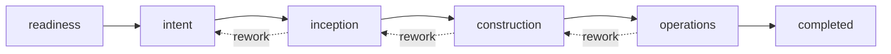

# AI-SDLC method overview

Pack: [registry/methods/ai-sdlc](../../registry/methods/ai-sdlc/METHOD.md). Concepts are independent Agora constructs inspired by publicly described AI-driven development practices (such as AWS AI-DLC); this project is not affiliated with or endorsed by AWS and requires no AWS service.

- Forward transitions are guarded by gates (`readiness-approved`, `intent-framed`, `architecture-approved`, `build-verified`, `completion`); rework transitions are ungated but explicit and preserve history.
- Pattern per phase: plan, clarify, human decision, execute, validate ([PROTOCOL](../../registry/methods/ai-sdlc/PROTOCOL.md)).
- Roles: product-owner, architect, builder, operator, quality-reviewer. The full role/capability matrix is issue #15; gate refinement is #17/#18.
- Verification here is structural (graph and Core install/validate). The end-to-end lifecycle sample is issue #21.
